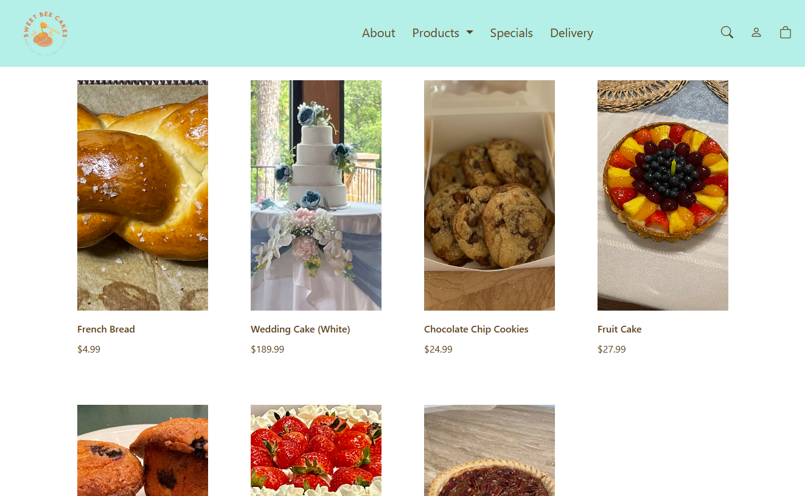
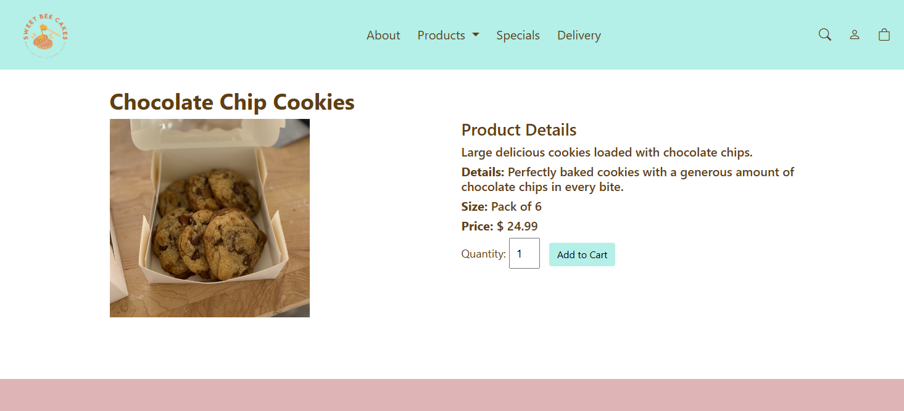
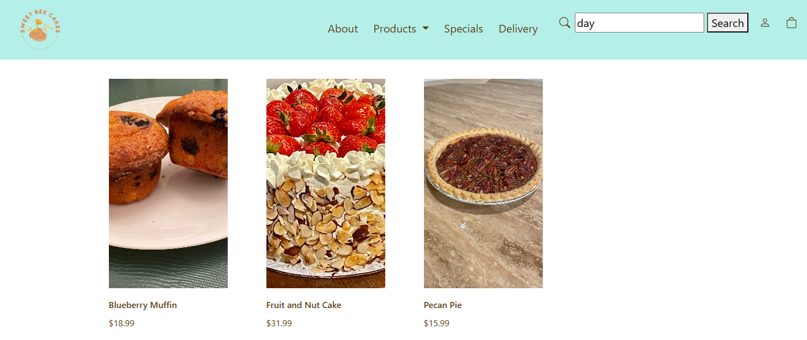
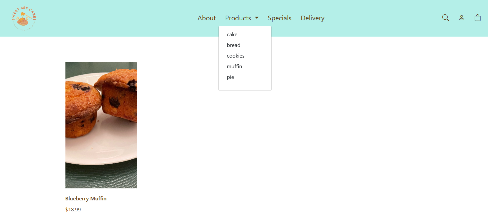
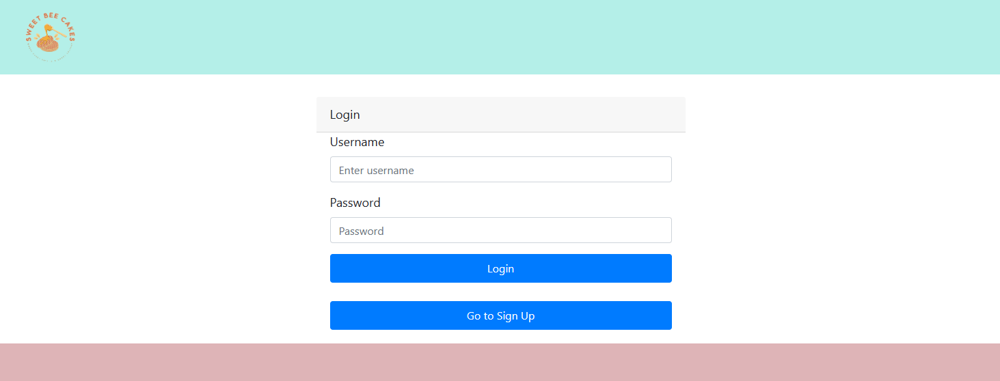
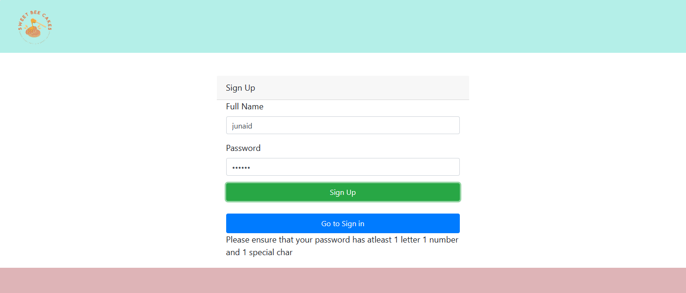
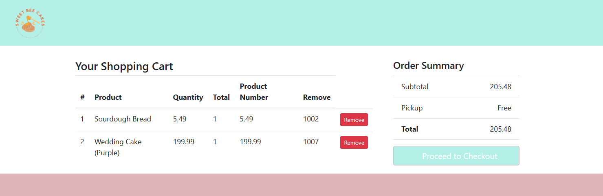
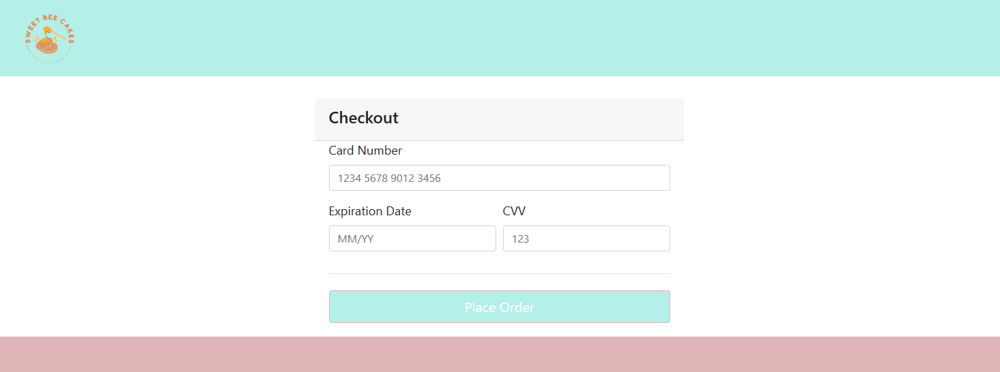
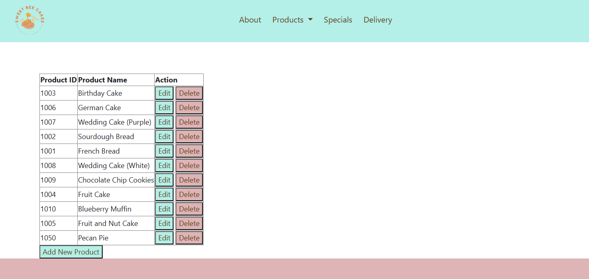

# Sweet Bee Cakes

**Sweet Bee Cakes** is a delightful e-commerce website designed to provide a seamless and enjoyable shopping experience for bakery enthusiasts, at the local bakery shop.

This project was completed in the following setting:

-   University: [University of Texas at Dallas](https://www.utdallas.edu/)
-   Course: [CS 6314 (Web Programming Languages)](https://catalog.utdallas.edu/2023/graduate/courses/cs6313)
-   Professor: [Meghana Maadugundu](https://www.linkedin.com/in/meghana-spurthi)
-   Semester: Fall 2023

_**Disclaimer**: This is a fictitious e-commerce website created for educational purposes. It does not represent an actual business._

## Key Features

-   🎂 **Search/Filter**: Browse through a delectable assortment of cakes for any occasion!
-   📝 **Registration**: Create an account with us to start ordering cakes!
-   🔒 **Authentication**: Our system ensures the security and protection of user credentials and personal information.
-   🛒 **Shopping Cart**: Easily add your favorite cakes to your cart, manage quantities, and proceed to checkout with ease.
-   🛠️ **Administration**: Dedicated admin page to add, edit, or delete products, giving admins full control over the product catalog.

## Demo

**Home Page**

**Product Page**

**Searching**

**Filtering**

**Sign In**

**Sign Up**

**Cart Page**

**Checkout Page**

**Admin Page**

